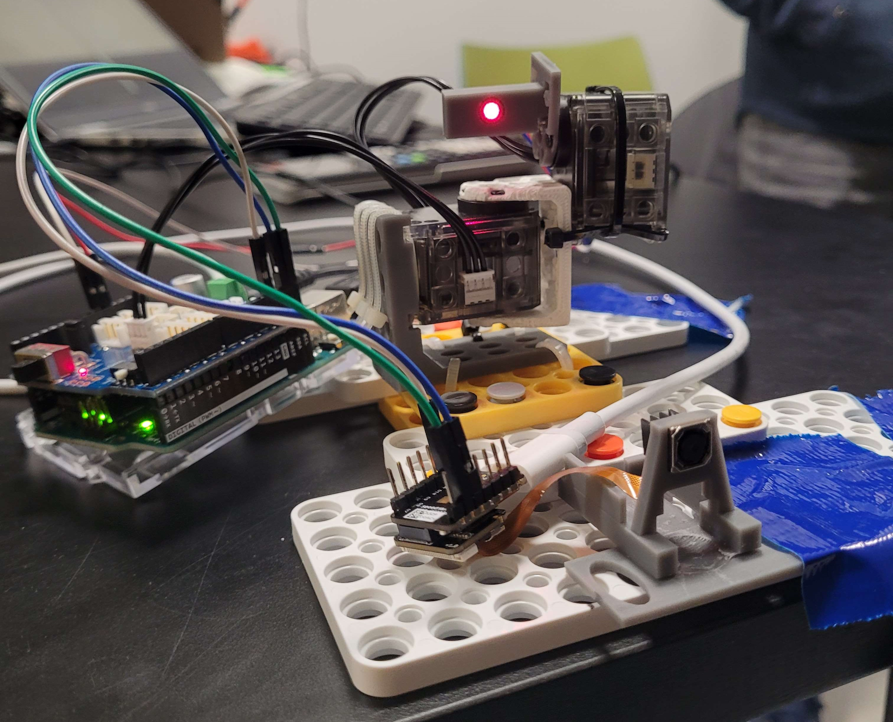
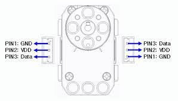

# Laser-Targeting-System

Public repository of our final iteration

## For EECS 452 Use

### Installing/Downloading library
[Dynamixel offical Arduino library](https://github.com/ROBOTIS-GIT/DynamixelShield/tree/master)

Go to the Aruino -> libraries. The Arduino folder is by default in documents folder for Windows.

git clone this repo

Run xl320_servo_example on Arduino IDE.

### Tutorial/Tips

When uploading the arduino sketch, MAKE SURE TO UNPLUG RX AND TX before uploading.

After it is uploaded, plug rx tx back in and press reset button to make sure "setup" section is ran.

### Chaniging parameters

For adjusting motor parameters, use the [dynamixel wizard 2.0](https://emanual.robotis.com/docs/en/software/dynamixel/dynamixel_wizard2/)

Parameters such as PID gains, baud rate, torque limit, etc. Will be easily accessible through the wizard. [XL-320 Control Table](https://emanual.robotis.com/docs/en/dxl/x/xl320/#control-table-data-address)

[Protocol 2.0 document](http://support.robotis.com/en/product/actuator/dynamixel_pro/communication/instruction_status_packet.htm) 

1. Connect the USB dongle and CONNECT POWER ADADPTER.
2. (One time setting) go to options and pick protocol 2.0 and select all in "Select port to scan" and hit ok.
3. Press scan in top left corner
4. When the servo shows up on the left column section, hit skip.
5. Change parameters. (Make sure torque is off on the top right section of the wizard when changing parameters.)

### Current angle limit
x axis rotation: 256 - 464 (in decimal) (-30 to 30 degrees) 
y axis rotation: 515 - 820 (in decimal) (-45 to 45 degrees)

### Wiring diagram

Looking from above, with the servo head at the top, wire the left plug of the servo to:

* PIN1: GND
* PIN2: 5 volts
* PIN3: Serial TX

